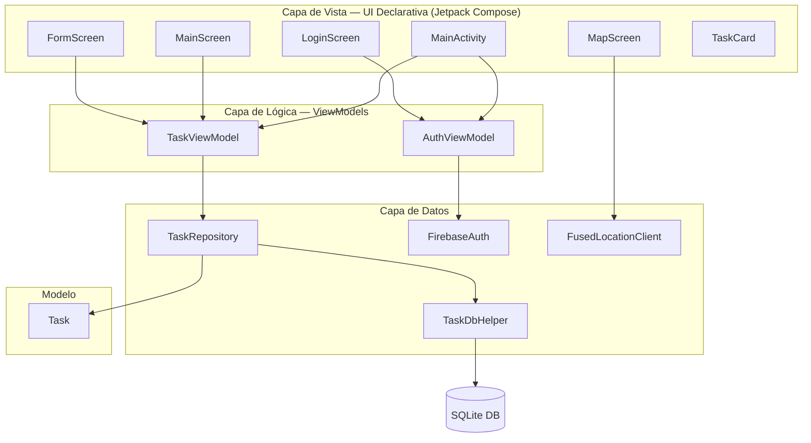
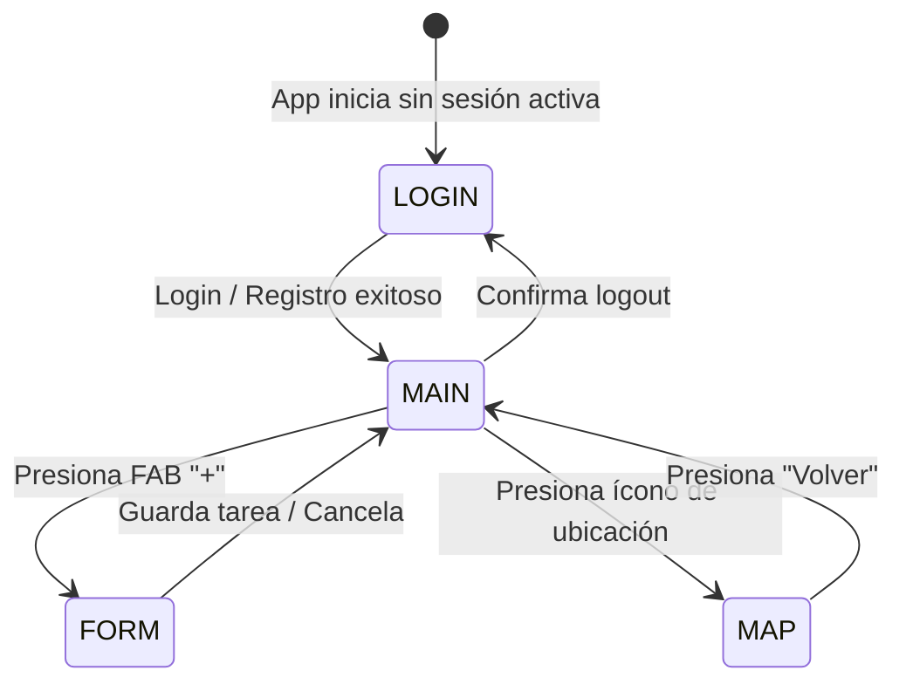

# Informe de Proyecto: Aplicación de Gestión de Tareas "FlowTask"

**UNIVERSIDAD TECNOLÓGICA DE BOLÍVAR (UTB)**
**FACULTAD DE INGENIERÍA**
**DESARROLLO DE DISPOSITIVOS MÓVILES**

---

## Resumen Ejecutivo

El presente informe documenta el proceso de diseño, estructuración y desarrollo de **FlowTask**, una aplicación móvil nativa para la plataforma Android desarrollada en **Kotlin** con **Jetpack Compose** bajo el patrón arquitectónico **MVVM**. El proyecto abarca dos entregas evaluativas: la primera establece las bases de UI/UX, navegación y gestión de tareas en memoria; la segunda integra autenticación de usuarios con **Firebase Authentication**, visualización de ubicación geográfica con **Google Maps API**, persistencia de datos con **SQLite** y mejoras adicionales de interfaz y seguridad.

---

## 1. Introducción y Justificación

El desarrollo de aplicaciones móviles modernas exige la integración de servicios externos, persistencia de datos y mecanismos de seguridad que protejan la información del usuario. **FlowTask** evolucionó de una aplicación de gestión de tareas en memoria hacia una solución completa que conecta con servicios en la nube (Firebase), accede al hardware del dispositivo (GPS), persiste datos localmente (SQLite) y protege el acceso mediante autenticación.

La elección de **Jetpack Compose** como framework de UI, **Firebase** como backend de autenticación, **Google Maps SDK** para servicios de ubicación y **SQLite** para almacenamiento local responde a la demanda actual de la industria móvil Android, donde estas tecnologías representan el estándar de facto para aplicaciones de producción.

---

## 2. Objetivos del Proyecto

### Objetivo General
Desarrollar y evolucionar una aplicación móvil nativa Android en Kotlin y Jetpack Compose que integre autenticación de usuarios, servicios de geolocalización, persistencia local de datos y una interfaz de usuario accesible e intuitiva.

### Objetivos Específicos

**Entrega 1 — Fundamentos:**
1. Diseñar wireframes y mockups que definan la jerarquía visual antes de la codificación.
2. Implementar arquitectura MVVM con separación limpia de capas.
3. Manejar navegación entre pantallas mediante estados reactivos sin dependencias externas.
4. Garantizar accesibilidad con touch targets de 48dp y contraste WCAG.

**Entrega 2 — Integración de Servicios:**
1. Integrar Firebase Authentication para login y registro con correo/contraseña.
2. Incorporar Google Maps SDK para mostrar la ubicación actual del usuario en tiempo real.
3. Reemplazar el almacenamiento en memoria por persistencia real con SQLite.
4. Mejorar la UI/UX con flujo de autenticación, modal de confirmación de logout e icono de visibilidad de contraseña.

---

## 3. Especificaciones Técnicas

| Parámetro | Valor |
|---|---|
| Lenguaje | Kotlin 1.9.23 |
| UI Framework | Jetpack Compose (BOM 2024.04.01) |
| Arquitectura | MVVM |
| compileSdk / targetSdk | 34 (Android 14) |
| minSdk | 24 (Android 7.0) |
| JVM Target | Java 17 |
| Firebase Auth | firebase-auth-ktx (BoM 32.8.1) |
| Google Maps | play-services-maps 18.2.0 + maps-compose 4.3.3 |
| Ubicación | play-services-location 21.2.0 |
| Persistencia | SQLite (androidx.sqlite 2.1.0) |
| Google Services Plugin | 4.4.1 |

---

## 4. Funcionalidades de la Aplicación

### 4.1 Autenticación (Firebase Authentication)
- Inicio de sesión con correo electrónico y contraseña.
- Registro de nuevas cuentas desde la misma pantalla.
- Validación de formato de correo y longitud mínima de contraseña (6 caracteres) antes de llamar a Firebase.
- Mensajes de error traducidos al español para todos los códigos de error de Firebase (`ERROR_WRONG_PASSWORD`, `ERROR_USER_NOT_FOUND`, `ERROR_EMAIL_ALREADY_IN_USE`, `FirebaseNetworkException`, etc.).
- Indicador de carga durante operaciones de autenticación.
- Icono de ojo para alternar visibilidad de la contraseña.
- Modal de confirmación con opciones "Sí, cerrar sesión" / "No, cancelar" al pulsar logout.
- Redirección automática a la pantalla de tareas tras autenticación exitosa y al login tras logout.

### 4.2 Gestión de Tareas con Persistencia SQLite
- Creación de tareas con título (obligatorio) y descripción (opcional).
- Validación del campo título con mensaje de error accesible.
- Marcado de tareas como completadas con animación de color y tachado visual.
- Eliminación de tareas con feedback visual inmediato.
- Indicador de progreso circular con porcentaje en tiempo real.
- Todas las operaciones persisten en base de datos SQLite local — los datos sobreviven al cierre de la app.

### 4.3 Servicios de Ubicación (Google Maps)
- Solicitud de permiso de ubicación en runtime (`ACCESS_FINE_LOCATION`).
- Obtención de ubicación fresca mediante `getCurrentLocation(PRIORITY_HIGH_ACCURACY)`.
- Visualización en mapa interactivo de Google Maps centrado en la posición del usuario.
- Marcador con etiqueta en la ubicación actual.
- Botón de "Mi Ubicación" nativo del SDK de Maps.
- Pantalla de fallback con botón para conceder permiso si fue denegado.

### 4.4 Interfaz de Usuario y Accesibilidad
- Navegación estructurada entre 4 pantallas: LOGIN → MAIN → FORM / MAP.
- Touch targets mínimos de 48dp en todos los elementos interactivos.
- Soporte completo de modo oscuro y claro sincronizado con el sistema.
- `contentDescription` en todos los íconos para lectores de pantalla.
- `semantics { contentDescription }` en la tarjeta de progreso.
- Textos de soporte (`supportingText`) en campos de formulario con estados de error.

---

## 5. Arquitectura del Software (MVVM)



### Descripción de Componentes

| Componente | Tipo | Responsabilidad |
|---|---|---|
| `MainActivity` | ComponentActivity | Punto de entrada, router de navegación, instanciación de ViewModels |
| `AuthViewModel` | ViewModel | Estado de autenticación Firebase, login/registro/logout, traducción de errores |
| `TaskViewModel` | AndroidViewModel | Estado reactivo de tareas, delega CRUD al repositorio |
| `TaskRepository` | Repository | Abstracción de acceso a datos SQLite en `Dispatchers.IO` |
| `TaskDbHelper` | SQLiteOpenHelper | Creación y migración del esquema de base de datos |
| `Task` | Data Class | Modelo inmutable con id (UUID), título, descripción y estado |

---

## 6. Estructura del Proyecto

```
FlowTask/
├── app/
│   ├── google-services.json          # Configuración Firebase
│   ├── build.gradle.kts              # Dependencias + manifestPlaceholders Maps key
│   └── src/main/
│       ├── AndroidManifest.xml       # Permisos INTERNET, LOCATION + meta-data Maps key
│       └── java/com/utb/flowtask/
│           ├── MainActivity.kt       # Router enum Screen {LOGIN, MAIN, FORM, MAP}
│           ├── model/
│           │   └── Task.kt           # Data class (id, title, description, isCompleted)
│           ├── data/
│           │   ├── TaskDbHelper.kt   # SQLiteOpenHelper — tabla tasks
│           │   └── TaskRepository.kt # CRUD suspend functions en Dispatchers.IO
│           ├── viewmodel/
│           │   └── TaskViewModel.kt  # AndroidViewModel con mutableStateListOf
│           ├── auth/
│           │   └── AuthViewModel.kt  # Firebase Auth + StateFlow<AuthState>
│           └── ui/
│               ├── theme/            # Color.kt, Type.kt, Theme.kt (Material 3)
│               ├── components/
│               │   └── TaskCard.kt   # Componente reutilizable de tarea
│               └── screens/
│                   ├── LoginScreen.kt  # Formulario email/password + validación
│                   ├── MainScreen.kt   # Dashboard con progreso + íconos de acción
│                   ├── FormScreen.kt   # Formulario nueva tarea
│                   └── MapScreen.kt    # Google Map + permiso ubicación en runtime
├── gradle/
│   └── libs.versions.toml            # Version catalog centralizado
├── local.properties                  # SDK path + MAPS_API_KEY (no versionado en prod)
└── .gitignore
```

---

## 7. Base de Datos SQLite

### Esquema

```sql
CREATE TABLE IF NOT EXISTS tasks (
    id           TEXT PRIMARY KEY,
    title        TEXT NOT NULL,
    description  TEXT,
    is_completed INTEGER NOT NULL DEFAULT 0
)
```

### Operaciones implementadas

| Método | SQL | Hilo |
|---|---|---|
| `getAll()` | `SELECT * FROM tasks ORDER BY is_completed ASC, title ASC` | `Dispatchers.IO` |
| `insert(task)` | `INSERT INTO tasks VALUES (...)` | `Dispatchers.IO` |
| `update(task)` | `UPDATE tasks SET ... WHERE id = ?` | `Dispatchers.IO` |
| `delete(id)` | `DELETE FROM tasks WHERE id = ?` | `Dispatchers.IO` |

El `TaskViewModel` mantiene un `mutableStateListOf<Task>` como caché reactiva en memoria que se sincroniza con la base de datos en cada operación, garantizando que Compose recomponga la UI sin lecturas adicionales a disco.

---

## 8. Firebase Authentication

### Configuración requerida

1. Proyecto en Firebase Console con app Android registrada (`com.utb.flowtask`).
2. Authentication → Sign-in method → **Email/Password** habilitado.
3. `google-services.json` en `app/`.
4. Plugin `com.google.gms.google-services` aplicado en Gradle.

### Estados de autenticación

```kotlin
sealed class AuthState {
    object Idle          : AuthState()   // Sin sesión activa
    object Loading       : AuthState()   // Operación en curso
    object Authenticated : AuthState()   // Sesión válida
    data class Error(val message: String) : AuthState()  // Error traducido
}
```

### Errores Firebase traducidos al español

| Código Firebase | Mensaje mostrado al usuario |
|---|---|
| `FirebaseNetworkException` | Sin conexión a internet. Verifica tu red e inténtalo de nuevo. |
| `ERROR_INVALID_EMAIL` | El formato del correo electrónico no es válido. |
| `ERROR_WRONG_PASSWORD` | Contraseña incorrecta. Inténtalo de nuevo. |
| `ERROR_USER_NOT_FOUND` | No existe una cuenta con este correo electrónico. |
| `ERROR_EMAIL_ALREADY_IN_USE` | Este correo electrónico ya está registrado. |
| `ERROR_WEAK_PASSWORD` | La contraseña debe tener al menos 6 caracteres. |
| `ERROR_TOO_MANY_REQUESTS` | Demasiados intentos fallidos. Intenta más tarde. |
| `ERROR_INVALID_CREDENTIAL` | Las credenciales son incorrectas o han expirado. |

---

## 9. Google Maps API

### Configuración requerida

1. Maps SDK for Android habilitado en Google Cloud Console.
2. API Key restringida por package name (`com.utb.flowtask`) y SHA-1.
3. API Key almacenada en `local.properties` como `MAPS_API_KEY=...`.
4. Inyectada al Manifest vía `manifestPlaceholders` en `app/build.gradle.kts`.

```kotlin
// app/build.gradle.kts
manifestPlaceholders["MAPS_API_KEY"] = localProperties.getProperty("MAPS_API_KEY", "")
```

```xml
<!-- AndroidManifest.xml -->
<meta-data
    android:name="com.google.android.geo.API_KEY"
    android:value="${MAPS_API_KEY}" />
```

### Flujo de ubicación

1. `LaunchedEffect` verifica si el permiso ya está concedido con `ContextCompat.checkSelfPermission`.
2. Si no, lanza `rememberLauncherForActivityResult(RequestPermission)`.
3. Con permiso, llama `FusedLocationProviderClient.getCurrentLocation(PRIORITY_HIGH_ACCURACY)` para obtener coordenadas frescas (evita caché desactualizada).
4. La cámara del mapa se desplaza a la ubicación con zoom 15f.

---

## 10. Flujo de Navegación



### Lógica de routing en MainActivity

```kotlin
LaunchedEffect(authState) {
    when (authState) {
        is AuthState.Authenticated -> if (currentScreen == Screen.LOGIN) currentScreen = Screen.MAIN
        is AuthState.Idle          -> currentScreen = Screen.LOGIN
        else                       -> Unit
    }
}
```

---

## 11. Dependencias del Proyecto

```toml
[versions]
agp                = "8.3.2"
kotlin             = "1.9.23"
composeBom         = "2024.04.01"
firebaseBom        = "32.8.1"
playServicesMaps   = "18.2.0"
mapsCompose        = "4.3.3"
playServicesLocation = "21.2.0"
sqlite             = "2.1.0"
googleServices     = "4.4.1"

[libraries]
firebase-bom                          # Firebase Bill of Materials
firebase-auth                         # firebase-auth-ktx
play-services-maps                    # Google Maps SDK Android
maps-compose                          # Wrapper Compose para Google Maps
play-services-location                # FusedLocationProviderClient
androidx-sqlite                       # SQLite API (androidx.sqlite:sqlite)
androidx-compose-material-icons-extended  # Íconos Visibility/VisibilityOff
```

---

## 12. Plan de Pruebas

### Autenticación

| Escenario | Acción | Resultado esperado |
|---|---|---|
| Login exitoso | Correo y contraseña válidos existentes | Redirige a pantalla de tareas |
| Login fallido | Contraseña incorrecta | Mensaje en español debajo de los campos |
| Registro nuevo | Correo nuevo + contraseña ≥ 6 chars | Cuenta creada y redirige a tareas |
| Correo duplicado | Registro con correo ya existente | "Este correo electrónico ya está registrado." |
| Sin internet | Cualquier acción de auth | "Sin conexión a internet. Verifica tu red." |
| Ver contraseña | Pulsar ícono de ojo | Alterna entre texto oculto y visible |
| Logout | Ícono de salida → confirmar "Sí" | Vuelve al login, sesión cerrada |
| Logout cancelado | Ícono de salida → "No, cancelar" | Permanece en la app con sesión activa |

### Gestión de Tareas

| Escenario | Acción | Resultado esperado |
|---|---|---|
| Crear tarea | Título + descripción → Guardar | Tarea aparece en lista, persiste al reabrir |
| Campo vacío | Guardar sin título | Mensaje de error en rojo, no navega |
| Completar tarea | Marcar checkbox | Texto tachado, progreso actualizado, persiste |
| Eliminar tarea | Pulsar ícono de papelera | Tarea desaparece, progreso recalculado |
| Persistencia | Cerrar y reabrir app | Todas las tareas siguen presentes |

### Ubicación y Mapas

| Escenario | Acción | Resultado esperado |
|---|---|---|
| Permiso concedido | Abrir pantalla de mapa | Mapa centrado en ubicación actual con marcador |
| Permiso denegado | Rechazar permiso | Pantalla de fallback con botón "Conceder Permiso" |
| Mapa gris | Desactivar WiFi y abrir mapa | Confirma que tiles vienen de GCP |

---

## 13. Configuración del Entorno de Desarrollo

### Prerrequisitos
- Android Studio Hedgehog o superior
- JDK 17
- Android SDK (compileSdk 34)
- Cuenta en Firebase Console
- Cuenta en Google Cloud Console con Maps SDK for Android habilitado

### Variables de entorno (local.properties)
```properties
sdk.dir=<ruta_al_android_sdk>
MAPS_API_KEY=<tu_api_key_de_google_maps>
```

### Archivos requeridos (no incluidos en VCS en proyectos de producción)
- `app/google-services.json` — descargado desde Firebase Console
- `local.properties` — generado localmente con SDK path y Maps API key

---

## 14. Conclusiones

1. **Firebase Authentication** simplificó la implementación de un flujo de autenticación seguro, permitiendo enfocarse en la UX en lugar de la infraestructura de seguridad. La traducción de errores al español mejora significativamente la experiencia del usuario final.

2. **SQLite con AndroidViewModel** resolvió el problema de la volatilidad de datos en memoria. El patrón Repository + Dispatchers.IO garantiza que las operaciones de disco nunca bloqueen el hilo principal, manteniendo la UI fluida.

3. **Google Maps SDK para Compose** (`maps-compose`) se integró naturalmente en la arquitectura declarativa existente sin necesidad de `AndroidView`, aprovechando los composables `GoogleMap`, `Marker` y `rememberCameraPositionState` de forma idiomática.

4. **Captive Portal Detection** en emuladores Android puede bloquear el acceso a Firebase incluso cuando el PC host tiene internet. La solución es deshabilitar la detección (`captive_portal_mode = 0`) vía ADB o hacer un Cold Boot del emulador.

5. **Recomendación para producción**: migrar SQLite a **Room Database** para obtener migraciones automáticas, soporte de Flow/LiveData nativo y type-safe queries; y considerar **Firebase Realtime Database** o **Firestore** para sincronización multi-dispositivo.