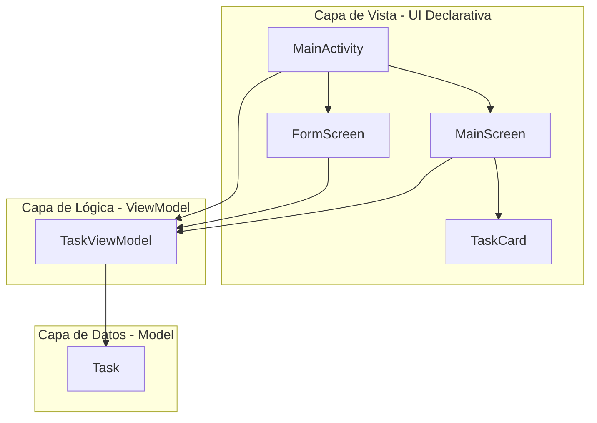
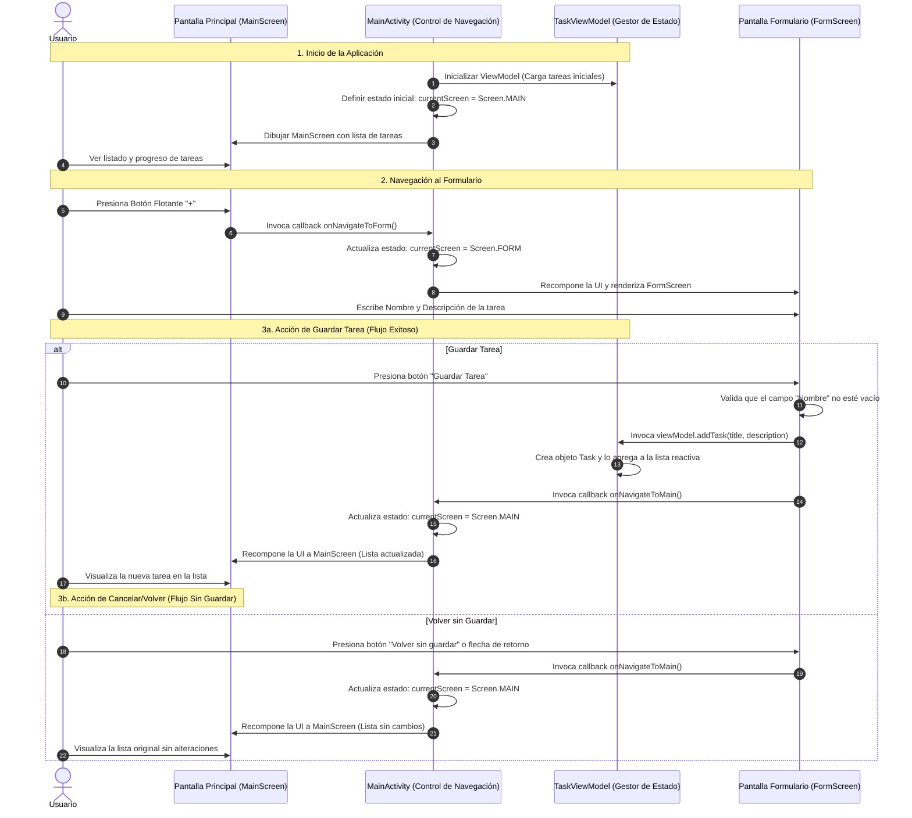

# Informe de Proyecto: Aplicación de Gestión de Tareas "FlowTask"

**UNIVERSIDAD TECNOLÓGICA DE BOLÍVAR (UTB)**  
**FACULTAD DE INGENIERÍA**  
**DESARROLLO DE DISPOSITIVOS MÓVILES**  

---

## 📝 Resumen Ejecutivo

El presente informe documenta el proceso de diseño, estructuración y desarrollo de **FlowTask**, una aplicación móvil nativa para la plataforma Android. Utilizando las tecnologías de vanguardia de la industria, la aplicación fue programada en **Kotlin** y construida de forma declarativa con **Jetpack Compose** bajo el patrón de diseño de software **Modelo-Vista-VistaModelo (MVVM)**. El objetivo principal es ofrecer una solución interactiva, ágil y visualmente atractiva para la gestión de tareas cotidianas, aplicando estrictos criterios de UI/UX, accesibilidad y estabilidad de estados móviles.

---

## 1. Introducción y Justificación

El desarrollo de aplicaciones móviles ha evolucionado hacia paradigmas declarativos que simplifican la sincronización entre el estado de los datos y la interfaz visual. En el ecosistema Android, **Jetpack Compose** reemplaza los antiguos e inflexibles esquemas basados en vistas XML, facilitando la creación de interfaces dinámicas con menos código, mejor rendimiento y mayor cohesión al utilizar únicamente Kotlin para todo el stack.

**FlowTask** nace como respuesta a la necesidad de contar con una herramienta organizada, intuitiva y rápida para registrar pendientes diarios. Su implementación no solo responde a criterios funcionales, sino que sirve como proyecto integrador para aplicar técnicas avanzadas de **State Hoisting** (elevación de estado), inyección e inicialización de **ViewModels** del ciclo de vida y diseño de interfaces accesibles adaptadas a los estándares contemporáneos de la industria.

---

## 2. Objetivos del Proyecto

### Objetivo General
Desarrollar una aplicación móvil nativa para Android en Kotlin y Jetpack Compose orientada a la gestión interactiva de tareas diarias, aplicando principios rigurosos de diseño UI/UX, arquitectura de software MVVM y flujos de navegación estructurados por estados.

### Objetivos Específicos
1. **Diseñar las bases visuales (Wireframes y Mockups)**: Planificar la jerarquía visual y la distribución espacial de los componentes en escala de grises y alta fidelidad antes de la codificación.
2. **Implementar una arquitectura escalable (MVVM)**: Separar limpiamente la capa de presentación, la lógica de negocio y las estructuras de datos para garantizar código limpio y mantenible.
3. **Manejar la navegación mediante estados reactivos**: Programar la transición bidireccional entre la pantalla principal y el formulario utilizando variables de estado hoisted (`currentScreen`) sin sobrecargar la aplicación con dependencias externas pesadas.
4. **Garantizar la accesibilidad (UI/UX)**: Implementar dimensiones táctiles mínimas de `48.dp` para elementos interactivos, altos niveles de contraste para legibilidad en modo oscuro y micro-animaciones fluidas de transición de estados.

---

## 3. Especificaciones y Funcionalidades Principales

La aplicación cuenta con las siguientes capacidades funcionales e interactivas:
* **Dashboard Centralizado (Pantalla Principal)**: Presenta la marca de la aplicación y un widget de estadísticas dinámico que calcula en tiempo real la fracción y el porcentaje de tareas completadas utilizando un indicador circular.
* **Controladores de Tareas**: Permite al usuario marcar tareas como completadas (lo que aplica una animación de color y tachado visual) o eliminarlas instantáneamente de la lista en memoria.
* **Formulario de Registro Validado**: Permite registrar el título y la descripción detallada. Cuenta con validadores automáticos en el hilo principal que alertan al usuario y bloquean el guardado si el campo del nombre se encuentra vacío.
* **Navegación Unidireccional Controlada**: Provee un flujo lógico e intuitivo que redirige de forma automática al Dashboard tras un guardado exitoso o permite la cancelación explícita mediante el botón "Volver" o la navegación por hardware del dispositivo, previniendo la pérdida de datos o pantallas huérfanas.
* **Tema Oscuro Premium Nativo**: Sincroniza la barra de estado y de navegación del sistema Android con la paleta de colores de la interfaz, logrando una estética inmersiva.

---

## 4. Arquitectura y Diseño del Software

La arquitectura de la aplicación se rige por el estándar **MVVM**, lo cual desvincula las vistas de la lógica interna de almacenamiento de datos.

### Componentes Arquitectónicos:
1. **El Modelo ([Task.kt](file:///C:/Users/otmeza/Documents/WORKSPACES/UTB/DISPOSITIVOS_MOVILES/APP_MOBILE_1/app/src/main/java/com/utb/flowtask/model/Task.kt))**: Estructura inmutable representativa de los datos de la tarea.
2. **La Vista**: Representada por la actividad contenedora ([MainActivity.kt](file:///C:/Users/otmeza/Documents/WORKSPACES/UTB/DISPOSITIVOS_MOVILES/APP_MOBILE_1/app/src/main/java/com/utb/flowtask/MainActivity.kt)) y los componentes gráficos construidos con Compose ([MainScreen.kt](file:///C:/Users/otmeza/Documents/WORKSPACES/UTB/DISPOSITIVOS_MOVILES/APP_MOBILE_1/app/src/main/java/com/utb/flowtask/ui/screens/MainScreen.kt) y [FormScreen.kt](file:///C:/Users/otmeza/Documents/WORKSPACES/UTB/DISPOSITIVOS_MOVILES/APP_MOBILE_1/app/src/main/java/com/utb/flowtask/ui/screens/FormScreen.kt)).
3. **El Modelo de Vista ([TaskViewModel.kt](file:///C:/Users/otmeza/Documents/WORKSPACES/UTB/DISPOSITIVOS_MOVILES/APP_MOBILE_1/app/src/main/java/com/utb/flowtask/viewmodel/TaskViewModel.kt))**: Encargado de exponer la lista reactiva mediante un contenedor mutable nativo de Compose (`mutableStateListOf`). Esto asegura que cuando se agrega o se modifica una tarea, las vistas se redibujen (recompongan) automáticamente sin intervenciones manuales ni llamadas a métodos de refresco.

---

## 5. Diseño Visual de UI/UX (Proceso de Diseño)

Siguiendo el flujo de ingeniería de software, se planificó la experiencia de usuario a través de dos etapas consecutivas de diseño visual:

### 5.1 Wireframes (Baja Fidelidad)
Esquemas conceptuales sin color que sirvieron para definir la jerarquía espacial, los espaciados (paddings) y la colocación de los textos en relación a los botones táctiles:
* **Pantalla Principal (Esquema)**: [Ver Wireframe Principal](file:///C:/Users/otmeza/.gemini/antigravity/brain/0d736e97-d14c-4b3b-a877-ba552c098ddd/wireframe_main_screen_1780890045721.png)
* **Pantalla Formulario (Esquema)**: [Ver Wireframe Formulario](file:///C:/Users/otmeza/.gemini/antigravity/brain/0d736e97-d14c-4b3b-a877-ba552c098ddd/wireframe_form_screen_1780890057763.png)

### 5.2 Mockups (Alta Fidelidad)
Diseños visuales con aplicación de la tipografía y la paleta cromática del tema oscuro (Slate, Indigo y Violeta), sirviendo como la guía pixel-perfect exacta para la posterior codificación:
* **Pantalla Principal (Modo Oscuro)**: [Ver Mockup Principal](file:///C:/Users/otmeza/.gemini/antigravity/brain/0d736e97-d14c-4b3b-a877-ba552c098ddd/mockup_main_screen_1780890070933.png)
* **Pantalla Formulario (Modo Oscuro)**: [Ver Mockup Formulario](file:///C:/Users/otmeza/.gemini/antigravity/brain/0d736e97-d14c-4b3b-a877-ba552c098ddd/mockup_form_screen_1780890082476.png)

---

## 6. Flujo de Navegación de la Aplicación

El flujo de navegación permite moverse de manera lógica y predecible entre el panel principal y la captura de datos:

### Detalle Operativo de los Estados:
* **Estado `Screen.MAIN`**: Se mapea a la visualización de la lista. `MainActivity` inyecta la referencia del `TaskViewModel` en [MainScreen.kt](file:///C:/Users/otmeza/Documents/WORKSPACES/UTB/DISPOSITIVOS_MOVILES/APP_MOBILE_1/app/src/main/java/com/utb/flowtask/ui/screens/MainScreen.kt) para renderizar el listado en tiempo real.
* **Estado `Screen.FORM`**: Se activa al pulsar el FAB. La recomposición destruye de manera lógica el MainScreen en pantalla y monta el [FormScreen.kt](file:///C:/Users/otmeza/Documents/WORKSPACES/UTB/DISPOSITIVOS_MOVILES/APP_MOBILE_1/app/src/main/java/com/utb/flowtask/ui/screens/FormScreen.kt), el cual maneja estados locales mutables independientes para el almacenamiento temporal del texto escrito (`title` y `description`).

---

## 7. Desglose del Código Fuente Generado

El código se distribuye de manera modular en las siguientes rutas físicas dentro de la carpeta del proyecto:

### Configuración del Ciclo de Construcción (Gradle)
* **[settings.gradle.kts](file:///C:/Users/otmeza/Documents/WORKSPACES/UTB/DISPOSITIVOS_MOVILES/APP_MOBILE_1/settings.gradle.kts)**: Gestión de repositorios oficiales y declaración del módulo `:app`.
* **[build.gradle.kts (Project)](file:///C:/Users/otmeza/Documents/WORKSPACES/UTB/DISPOSITIVOS_MOVILES/APP_MOBILE_1/build.gradle.kts)**: Vinculación del compilador de Kotlin y plugins de empaquetado de Android.
* **[libs.versions.toml](file:///C:/Users/otmeza/Documents/WORKSPACES/UTB/DISPOSITIVOS_MOVILES/APP_MOBILE_1/gradle/libs.versions.toml)**: Catálogo de versiones estandarizadas que sincronizan Jetpack Compose 1.5.11 con Kotlin 1.9.23.
* **[build.gradle.kts (App)](file:///C:/Users/otmeza/Documents/WORKSPACES/UTB/DISPOSITIVOS_MOVILES/APP_MOBILE_1/app/build.gradle.kts)**: Configuración SDK, dependencias de Material 3 y habilitación del compilador de Compose.

### Configuración del Sistema Android
* **[AndroidManifest.xml](file:///C:/Users/otmeza/Documents/WORKSPACES/UTB/DISPOSITIVOS_MOVILES/APP_MOBILE_1/app/src/main/AndroidManifest.xml)**: Manifiesto que configura el ícono por defecto del sistema, el nombre visible de la app, y define a `MainActivity` como el punto de inicio del teléfono.
* **[strings.xml](file:///C:/Users/otmeza/Documents/WORKSPACES/UTB/DISPOSITIVOS_MOVILES/APP_MOBILE_1/app/src/main/res/values/strings.xml)**: Almacenamiento de cadenas de texto estáticas del sistema.

### Estructura Lógica y de Datos
* **[Task.kt](file:///C:/Users/otmeza/Documents/WORKSPACES/UTB/DISPOSITIVOS_MOVILES/APP_MOBILE_1/app/src/main/java/com/utb/flowtask/model/Task.kt)**: Estructura de modelo.
* **[TaskViewModel.kt](file:///C:/Users/otmeza/Documents/WORKSPACES/UTB/DISPOSITIVOS_MOVILES/APP_MOBILE_1/app/src/main/java/com/utb/flowtask/viewmodel/TaskViewModel.kt)**: Clase que hereda de `ViewModel` de Android, gestionando las operaciones CRUD reactivas.

### Componentes de UI Declarativa
* **[Color.kt](file:///C:/Users/otmeza/Documents/WORKSPACES/UTB/DISPOSITIVOS_MOVILES/APP_MOBILE_1/app/src/main/java/com/utb/flowtask/ui/theme/Color.kt)**: Definiciones cromáticas en hexadecimal (Material 3).
* **[Type.kt](file:///C:/Users/otmeza/Documents/WORKSPACES/UTB/DISPOSITIVOS_MOVILES/APP_MOBILE_1/app/src/main/java/com/utb/flowtask/ui/theme/Type.kt)**: Tipografía base de la app.
* **[Theme.kt](file:///C:/Users/otmeza/Documents/WORKSPACES/UTB/DISPOSITIVOS_MOVILES/APP_MOBILE_1/app/src/main/java/com/utb/flowtask/ui/theme/Theme.kt)**: Controlador de temas oscuros y claros con soporte para alteración dinámica de la barra de navegación del celular.
* **[TaskCard.kt](file:///C:/Users/otmeza/Documents/WORKSPACES/UTB/DISPOSITIVOS_MOVILES/APP_MOBILE_1/app/src/main/java/com/utb/flowtask/ui/components/TaskCard.kt)**: Componente interactivo para cada tarea con checkboxes y botones de acción rápida.
* **[MainScreen.kt](file:///C:/Users/otmeza/Documents/WORKSPACES/UTB/DISPOSITIVOS_MOVILES/APP_MOBILE_1/app/src/main/java/com/utb/flowtask/ui/screens/MainScreen.kt)**: Estructura Scaffold del dashboard.
* **[FormScreen.kt](file:///C:/Users/otmeza/Documents/WORKSPACES/UTB/DISPOSITIVOS_MOVILES/APP_MOBILE_1/app/src/main/java/com/utb/flowtask/ui/screens/FormScreen.kt)**: Formulario de captura y validaciones.
* **[MainActivity.kt](file:///C:/Users/otmeza/Documents/WORKSPACES/UTB/DISPOSITIVOS_MOVILES/APP_MOBILE_1/app/src/main/java/com/utb/flowtask/MainActivity.kt)**: Inyección de dependencias y ruteador de estados.

---

## 8. Plan de Pruebas y Validación de la Aplicación

Para asegurar que la aplicación funciona correctamente, se propone realizar el siguiente plan de validación manual en un dispositivo real o emulador:

### Escenario 1: Validación del Flujo de Creación Correcta
* **Acción**: Presionar el botón flotante "+", escribir "Estudiar Jetpack Compose" en el título, escribir una descripción y presionar "Guardar Tarea".
* **Resultado Esperado**: La aplicación regresa al panel principal de forma automática, el indicador de progreso se actualiza y la tarea aparece en la parte inferior con su checkbox desmarcado.

### Escenario 2: Validación del Bloqueo por Campos Vacíos
* **Acción**: Presionar "+", dejar el campo "Nombre de la tarea" en blanco y presionar "Guardar Tarea".
* **Resultado Esperado**: La aplicación no debe regresar al panel principal. Debe mostrar un mensaje de error en letras rojas que indique "El nombre de la tarea no puede estar vacío" y marcar el contorno del campo en color rojo.

### Escenario 3: Validación del Botón de Cancelación
* **Acción**: Presionar "+", ingresar datos en ambos campos y presionar "Volver sin guardar" o el botón "Atrás" del sistema Android.
* **Resultado Esperado**: La aplicación regresa al panel principal y no se debe haber guardado ninguna tarea nueva en la lista.

### Escenario 4: Interactividad de Tarea y Progreso
* **Acción**: Marcar la casilla de verificación de una tarea pendiente.
* **Resultado Esperado**: El texto de la tarea se tacha, el fondo de la tarjeta cambia a un color más atenuado con una animación y el indicador de progreso circular superior aumenta su porcentaje dinámicamente.

---

## 9. Conclusiones y Recomendaciones

1. **Eficiencia en el desarrollo con Compose**: Jetpack Compose ha demostrado simplificar enormemente la sincronización del estado con la UI. En comparación con los adaptadores complejos de `RecyclerView` en XML, la lista declarativa en `MainScreen` se construyó con menos líneas de código y mayor legibilidad.
2. **Importancia del patrón MVVM**: Implementar un `ViewModel` robusto garantiza que el estado mutable de las tareas no dependa directamente del ciclo de vida visual de la actividad, previniendo fallos al reorientar la pantalla.
3. **Recomendación para Desarrollos Futuros**: Para producciones a gran escala con almacenamiento permanente, se recomienda integrar una base de datos local usando **Room Database** conectada al repositorio del ViewModel, permitiendo la persistencia de las tareas incluso si la aplicación es cerrada por completo.